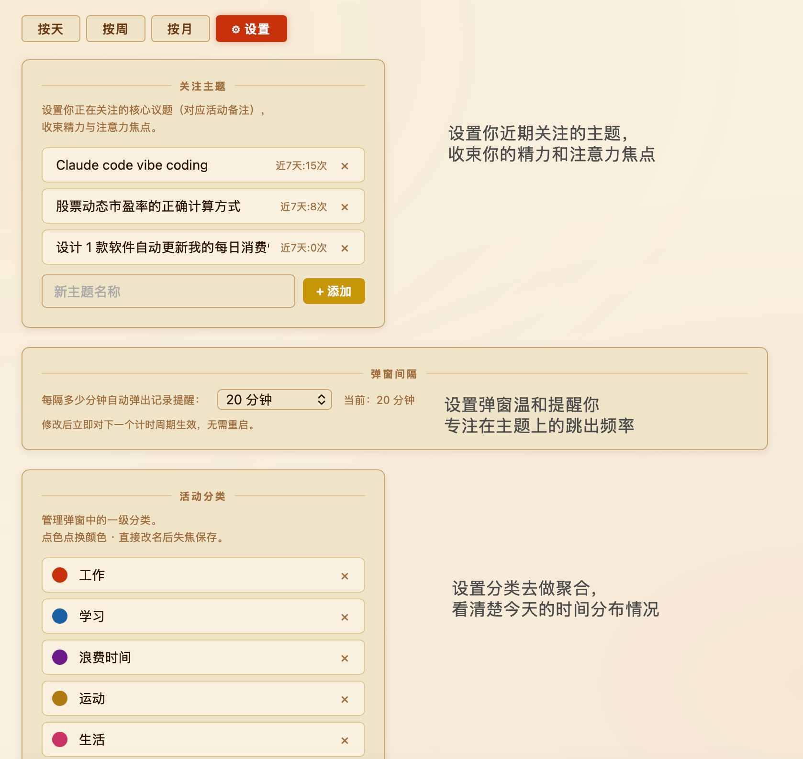

# ⏱ ActivityTracker — 活動記録

> 一款基于《秀逗魔導士》主题的 macOS 菜单栏时间追踪工具，每 15 分钟自动提醒你记录当前活动，并提供可视化 Dashboard。

---

## 📸 截图

| 弹窗提醒 | Dashboard 主界面 | 设置页 |
|----------|-----------------|--------|
|  |  |  |

> *截图目录：`docs/screenshots/`，可替换为实际截图。*

---

## ✨ 功能简介

### 自动记录
- 每 **15 分钟**自动弹出系统对话框，提示记录当前活动
- 选择**一级分类**（工作 / 学习 / 运动等），再输入具体备注
- 同一时间段重复记录时自动覆盖，不产生重复数据
- 提交后计时器从当前时刻重新开始倒计时

### Dashboard 可视化
- **按天 / 按周 / 按月** 三种视图切换，带日期前后导航
- 顶部分类汇总卡片，展示各大类的累积时长
- **关注主题 TOP 5**：从你设定的关注主题中按实际频次排名，每项附近 7 天角标
- 月视图热力日历（越深 = 记录越多）
- 点击任意记录可**编辑**分类和备注，或删除

### 手动补录
- 支持为任意过去时间段补录活动，精确到 15 分钟

### 设置管理
- **关注主题**：手动维护最多 10 个核心议题（对应活动备注），收束注意力焦点
- **活动分类**：新增、改名、删除分类，支持自定义颜色

### 系统集成
- 菜单栏常驻图标 ⏱，支持手动唤醒记录
- 登录后通过 **LaunchAgent** 自动启动，无需手动开启
- 数据存储在本地 SQLite，完全离线，隐私安全

---

## 🖥 系统要求

| 项目 | 要求 |
|------|------|
| 操作系统 | macOS 12 Monterey 及以上 |
| Python | 3.10+ |
| 包管理 | pip（推荐 Homebrew 或 Anaconda 环境）|

---

## 🚀 安装步骤

### 1. 克隆项目

```bash
git clone https://github.com/Tychebian/Acitivtytracker.git
cd Acitivtytracker
```

### 2. 安装依赖

```bash
pip install rumps flask pyobjc-framework-WebKit
```

或使用 requirements.txt：

```bash
pip install -r requirements.txt
pip install pyobjc-framework-WebKit
```

### 3. 一键安装（推荐）

```bash
chmod +x setup.sh
./setup.sh
```

脚本会自动完成：
- 检测可用 Python 环境
- 安装所有依赖
- 注册 **LaunchAgent**（开机自动启动）
- 将 `ActivityTracker.app` 安装到 Applications

### 4. 手动启动（可选）

```bash
python3 main_app.py
```

---

## 📖 如何使用

### 日常记录

1. 登录 Mac 后，菜单栏右上角出现 **⏱** 图标，表示已在后台运行
2. 每 15 分钟自动弹出对话框 → 选择分类 → 输入或选择备注 → 点击「记录」
3. 点击「跳过」可跳过本次，不影响下一次计时

### 手动唤醒

点击菜单栏 **⏱** 图标 → **记录当前活动 …**，可随时手动触发记录弹窗。

### 查看 Dashboard

点击菜单栏 **⏱** 图标 → **查看 Dashboard**，或直接双击 `ActivityTracker.app`。

### 补录历史

在 Dashboard 右上角点击 **✚ 补录往期记录**，选择日期和时间段，填写分类与备注后提交。

### 设置关注主题

Dashboard → **⚙ 设置** → 左侧「关注主题」→ 输入主题名称（与活动备注一致）→ 点击「+ 添加」。

设置后，Dashboard 主页「关注的主题 TOP 5」会自动统计这些主题的累积时长及近 7 天频次。

### 管理分类

Dashboard → **⚙ 设置** → 右侧「活动分类」→ 直接改名（失焦保存）、点色点换颜色、点 ✕ 删除。

---

## 📁 项目结构

```
activity_tracker/
├── tracker.py          # 菜单栏 App（rumps）+ 15 分钟计时器
├── main_app.py         # 主入口：启动 Dashboard 窗口 + tracker 子进程
├── dashboard.py        # Flask API 服务（REST 接口 + 页面渲染）
├── db.py               # SQLite 数据库操作
├── config.py           # 分类配置管理（读写 config.json）
├── dialog_helper.py    # tkinter 辅助弹窗（备用）
├── templates/
│   └── index.html      # Dashboard 前端（纯 HTML/CSS/JS，无外部依赖）
├── ActivityTracker.app # macOS App Bundle
├── setup.sh            # 一键安装脚本
└── requirements.txt    # Python 依赖
```

---

## 🗄 数据存储

数据库位于 `~/.activity_tracker/activities.db`，包含以下表：

| 表名 | 说明 |
|------|------|
| `activities` | 活动记录（时间戳、分类、备注）|
| `focus_topics` | 用户设定的关注主题列表 |

日志文件：
- `~/.activity_tracker/error.log` — 运行错误日志
- `~/.activity_tracker/output.log` — 标准输出日志

---

## 🔧 卸载

```bash
launchctl unload ~/Library/LaunchAgents/com.activitytracker.tracker.plist
rm ~/Library/LaunchAgents/com.activitytracker.tracker.plist
```

---

## 🎨 设计说明

界面配色灵感来自日本动画《秀逗魔導士（スレイヤーズ）》：

| 色值 | 对应元素 |
|------|----------|
| `#c8320a` 深红 | Lina 的火球魔法 |
| `#1a5fa3` 蓝色 | Freeze Arrow |
| `#6b1a8a` 紫色 | Shadow Magic |
| `#c8960a` 金色 | 魔法阵 |
| `#f8f0df` 羊皮纸 | 背景底色 |

---

## 📄 License

MIT License — 自由使用、修改与分发。
